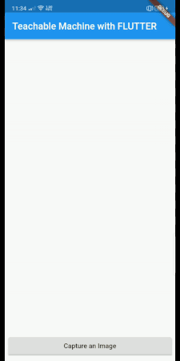
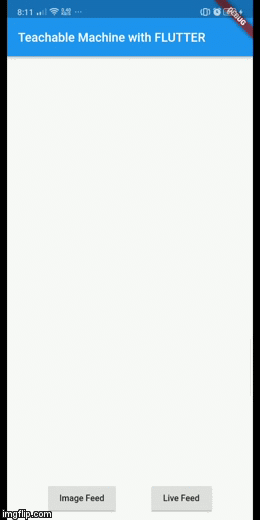

# :rocket: Teachable Machine in Flutter :sunglasses:

Integrating Teachable Machine in Flutter for Identifying number of fingers which is initially trained with a training set of 150 images for each number of fingers.

##### Of course, this doesn't give the efficient result, being trained with just 150 samples, but tells us how to connect Teachable Machine and how to deal with its Model in Flutter.

[Try it Yourself.](https://teachablemachine.withgoogle.com)

<!--  -->
| Image Feed | Live Feed |
| ------------- | ------------- |
|   |   |